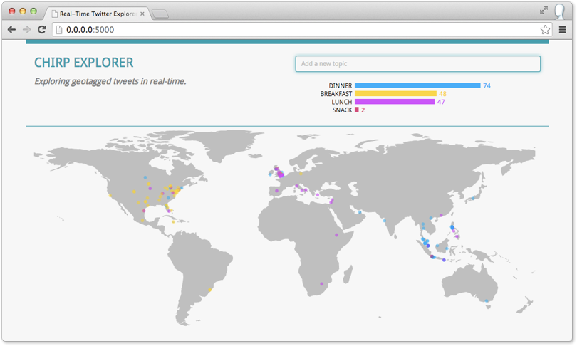

# Chirp Client

_Geotagged Tweets Explorer_ - Example for the book [Mastering D3.js][mastering-d3]

## About

<table>
  <tr>
    <td>
      
    </td>
    <td>
      This example is part of one of the examples in the book <a href="http://www.packtpub.com/bring-data-to-life-by-creating-and-deploying-complex-data-visualizations-with-d3js/book">Mastering D3.js</a>
    </td>
  </tr>
</table>

<!-- Links -->

[mastering-d3]: http://www.packtpub.com/bring-data-to-life-by-creating-and-deploying-complex-data-visualizations-with-d3js/book "Mastering D3.js"
